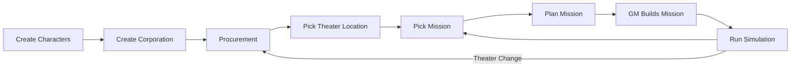
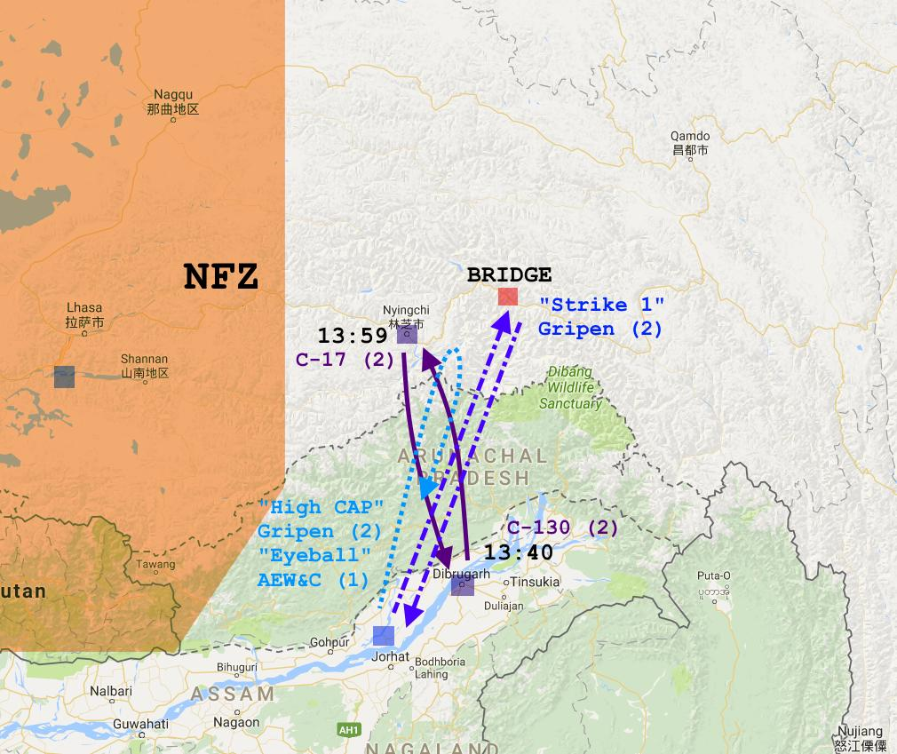
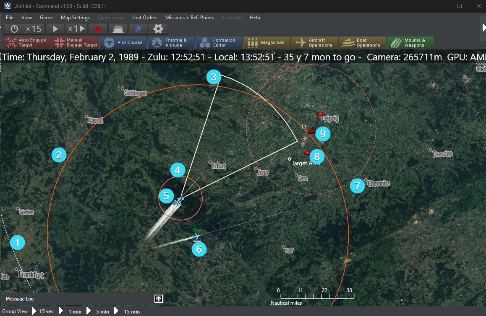

# Flow of Play

Strike Command has two areas of play. The first is **Multi-Domain**, the second is **Simulation**. The multi-domain section is where you perform negotiations, scouting, dealing with customers or rivals, and planning for the mission itself. The simulation is where the game moves into the battle space and you watch your plans unfold live in a military grade combat simulator.

## Multi-Domain :simple-multisim:

This is the traditional RPG time. Anything that doesn't occur as part of the mission, happens here. All activities in this space are to prepare for the simulation mission. 

### Skill Checks

If you need to determine success, or failure, during the Multi-Domain time, you perform a skill check. Skills come from your background, certain things can be done without any background or experience such as a negotiation. Other things require experience, such as hacking an air defense system. 

Take two different colored six sided dice. Define one as the HIGH, and the other as LOW. 

**Result = Skill - Difficulty + High - Low**

The result, if zero, will be no success or failure. Maybe you gained no knowledge, or couldn't pick a lock, or the negotiations stalled.

+1 or -1 - Modest success or failure with a hook. Yes, you gained some knowledge on a +1, but not everything. Or you failed to pick the lock, but you weren't detected.

+2 or -2: - Success or Failure. You managed to hack the computer and got what you expected. Or, you failed to hack the computer and alerted the enemy to your presence.

+3 or -3 - Critical success or Critical Failure. Not only did you enter into negotiations and get what you wanted, but it revealed critical information about enemy air defenses. Or, you failed to negotiate and the enemy PMC's now know exactly what your plans are.

There are some examples below in the Actions area.

### Initial Steps

:material-exclamation-thick: You can remain in a Theater of Operations until you wish to move to greener pastures.

:material-exclamation-thick: The Black Market is available in between missions and in between theaters. 

:material-exclamation-thick: Procurement and Procurement Upgrades *only occur initially and in between theaters.*

### Preparation and Actions

In between picking a mission and planning the mission is preparation. You need to understand the threat, understand the target, and decide how best to execute the mission. Just tossing airplanes into the sky and YOLO'ing it is not the best option. Unforeseen obstacles, SAM sites, or defenses could ruin your day. The MC will work with you to display a map, array the intel, and let you determine how best to approach it.

!!! Example

    A PMC Group called Maverick's Mutts have a contract to destroy a train travelling between Tallinn and St. Petersburg. They know another PMC is going to be screening the flight and a Russian SAM battalion is operating somewhere near the border. 
    
    Jakob, an Ex-CIA Operative, wants to call in a favor and get a satellite photo. The MC decides he has a +1 due to his relations with the CIA and it's a fairly easy request so he gets a +1 to the difficulty. He defines his first dice as the high, and the second dice as the low.
    
    :material-dice-3-outline: - :material-dice-2: + **1 Skill** + **1 Difficulty** = **3 Critical Success**
    
    Jakob not only gets his satellite map, but an analysts points out a SAM site.

!!! Example
    The Mutts now try to hack the SAM site. Winona, ex Air Force cyber security, is familiar with defending against these attacks but is unfamiliar with the best way to actually hack it. The group notices some power lines on the aerial map. So the MC offers instead that she can attempt to hack the power station near by as an easier option. 

    :material-dice-1-outline: - :material-dice-2: + **2 Skill** + **-2 Difficulty** = **1 Modest Failure**

    Winona is unable to shut down the power station, but the cyber attack has gone unnoticed.

### Planning

The best mission plans are laid out before hand and are flexible enough to allow the MC to plan out the flow. Once the planes have taken off they are on mission profile and **may not be micro-managed.** There are exceptions such as moving flight paths to avoid previously unknown serious threats, RTB'ing (return to base), or when something odd occurs in the simulation.

You are in a command post or a control tower staring at a digital map as the mission unfolds.

A good mission map will be simple enough to display the flow without too many details or contingencies. In the real world aircraft go up for a defined mission with defined armament, they are rarely retasked for something completely and wildly different. 

Work with your MC and sketch out your mission plan using the available assets. 

## Simulation :map:

The MC builds the simulation in CMO using the mission plan that the players have made. The group will observe and interact with the mission as the simulation unfolds. The MC will try to keep focus on the most interesting parts of the mission while making sure that the objectives have been completed. A forum post or YouTube video can also be a great way to run the mission.

There are no skill checks performed during the Simulation. However the MC may allow it in special circumstances but normally we want the simulation to be the arbiter of performance as it is considerably more detailed.

### Game View

The MC will be the one actually using CMO however it is useful to understand what you are looking at. The MC can hover or click on any unit icon and you can see the details including detailed database entries.

1. Range ring for non-player radar.
2. Range ring for Land/Surface Weapons.
3. Radar arc from player aircraft.
4. Range ring for air to air weaponry.
5. Groups of friendly aircraft with slug trails showing path.
6. Individual aircraft with slug trails behind.
7. Range ring for hostile SAM.
8. Target icon.
9. SAM system with unit count shown in top left.

### Time Compression

Most of the time you will run Time Compression while ingressing to the target area. The MC can "speed up" time to get past the boring bits. Though be careful not to go too fast as you can miss critical details.

### Icons

The MC can change iconography between a few different sets in the mission. I'd recommend on the first run through the cycle through the options and decide what everyone likes best. The NATO icons will be familiar to wargamers but the stylized icons may be easier to look at.

### Message Log

In the lower left corner is the Message Log. It can display information that the players might normally not see so it is up to the MC's discretion. But it can be a lot of fun to see the percentages as a unit dodges missiles and activates countermeasures. I tend to keep it closed until the engagement is on, then keep an eye on it for cool bits.

:material-arrow-right-box: **Now move on to the [How to Fight](howtofight.md) section.**

