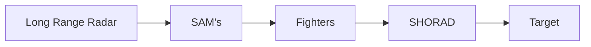
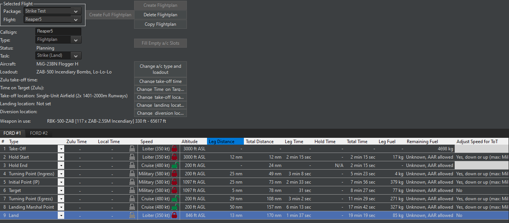

# How to Fight

## Modern Combat

Modern combat is deadly, unfair, and requires caution in all aspects. Seldom do you limp home, seldom is it a close fight, and seldom will things go as planned.

You might be itching to get to procurement and missions, but if you don't understand the basics of modern combat your choices could be flawed.

## Perceptions

The United States has not faced a peer adversary in air combat since 1945. It has not faced an air threat since 1991. Since then there have been tens of thousands of hours of combat flight time without the worry of another fighter jet engaging them. Nor have they had to worry about any SAM threat in these operations. This has changed perceptions about air operations in a way that will make you very surprised when you finally encounter a peer adversary with SAM coverage.

The largest, and most experienced, air force with the greatest media coverage has made our perception of air war incredibly lopsided. If you are in the military you likely understand this and also understand that a great jet does not win the battle but the logistics backbone, intelligence services, maintenance expertise, and sheer bulk of training. The battle is won before that jet ever takes off.

Except you don't have all of those advantages. You will lose planes. **The goal is to minimize the losses and maximize the profits.**

## Peeling the Onion

Any good opposing force will have SHORAD protected radars that are scrambling capable fighters, whose job it is to drive you down into SAM range, where you have no kinetic energy and cannot escape. **Speed is life.**

In order to get into the target you need to peel away the outer layers of the onion. First you blind the lang range radars. This forces the SAM radars to attempt to acquire targets, you then either jam them using OECM or hit that with anti-radiation missiles. If your timing is perfect about now your fighters will engage hostiles fighters, and if you have superior tactics or overwhelming numbers then you might punch a hole. Finally your strikers get close enough to drop ordnance and boogie.

## Knowing your Age

Air combat has evolved since 1945. What was once a sound tactic for striking SAM's (Wild Weaseling) would be now unheard of. The tactics are designed for the threats and with the weapons at hand. In Strike Command the era advised will be from the 1970's to the mid 1990's. You will have a wide range of capable aircraft with capable ordnance, but it pre-dates the US-NATO massive expansion of weaponry. A 1989 F-16 is much closer to a MIG-29 then the 2022 models.

Given such a wide range you can run into issues where a slight change in model year can have radically different radar performance and significantly longer air to air capabilities. On one hand this is great, but on the other it can be tough when the OPFOR has that advantage.

## The Knife Edge

You walk into every mission with a force that is capable. But several lucky SAM shots and suddenly your escorts are destroyed. Now your attack aircraft are un-protected and the mission should be scrubbed. Be aware that losses happen fast, and sometimes the best thing to do is GTFO. Now this can work to your advantage, knock out a couple of flight of hostile aircraft and suddenly you dominate the skies.

The best way to do this is have the awareness advantage. A well situated radar or airborne early warning radar will do more for your situational awareness than anything else. On top of this it allows your aircraft to **not emit radar until absolutely neccessary.** If done correctly the opposing force won't know you are there until they are defending from air to air missiles.

Barring an awareness advantage it comes down to range, evasiveness, and tactics. Shooting first is always excellent, so is being maneuverable, but absent that you can divert hostiles with a feint or lure them into friendly SAM range. Brute force and frontal attacks are typically not the best answer.

## BVR WVR SEAD WTF

The military loves acronyms. [Brevity codes](https://en.wikipedia.org/wiki/Multiservice_tactical_brevity_code) can be really great, and once you pick up on the jargon it won't be a problem.

* BVR - Beyond Visual Range, an air-to-air missile that can engage a target without the pilot visually identifying the threat.
* WVR - Within Visual Range, an engagement where the pilot can visually identify the target.
* SEAD - Suppression of Enemy Air Defenses.
* Winchester - All mission specific ordnance expended.
* Bingo - Low fuel state, time to RTB.
* RTB - Return to Base.
* Heater - Short(er) ranged infrared missile.

## Weather and Time

Some aircraft can function day or night, snow or rain, and do so quickly. Others can only operate during the day, in clear weather, and still have a hard time identifying targets. US-NATO aircraft tend to be able to function in any weather day or night, but not all. 

An example is an SU-25 Frogfoot, it needs to acquire targets visually and then guide the weapons in with a laser or pickle them the old fashioned way. If the target area is socked in with fog that Frogfoot can't see the targets. If it's night they likely don't even have night vision.

## Force Multipliers

Certain purchases will enable you to survive better than others. These include assets like an Airborne Early Warning jet, a ground based radar, an Aerial Refueler, or a SAM system. Sure another flight of jets is great, but why not make the jets you have more effective?

Among the best investments, and juiciest targets, is an Airborne Early Warning system. It is a high flying long range radar that gives you eyes further than a ground based radar could. They can stay aloft for a long time and give you awareness over the battlefield like nothing else. You can't fly under the terrain to sneak up on it, though you can confuse it with OECM. 

A ground based radar is the next best, though with limited range. 

Aerial refueling can let you stretch your legs further or stay aloft longer. Both can keep your base and facilities out of harms way. 

## Multi-role Vs. Single Role

Some aircraft, such as the F-16, are considered multi-role. They can act as attack aircraft, do SEAD missions, but also be an effective fighter. So you have one aircraft that can specialize in a variety of tasks.On the flip side is the MIG-31 Foxhound, which is 100% an interceptor and nothing but. Both were designed with different missions in mind so it's hard to make a fair comparison. 

Interestingly enough the original F-16 was a super light short range fighter and never envisioned to be the hulking fat-vipe that it is today. Some of this is platform creep, but also a desire to make do with less. The platform and mission was well suited, while the MIG-31 is still just an interceptor.

Some aircraft excel at a single role while others history has never given a chance to really shine. The A-10 gets a lot of press for what it is, but had it operated in contested airspace it's likely losses would have been staggering. 

## Gen V

Fifth [Generation](https://en.wikipedia.org/wiki/Jet_fighter_generations) fighters operate on a totally different scale than other aircraft. They are, as goofy as it sounds, the boss fights of modern air combat. They have incredible capabilities beyond just stealth or weaponry with [AESA radar](https://en.wikipedia.org/wiki/Active_electronically_scanned_array), visual detection, drones, and things we don't even know about. From a player standpoint they are neat to see, but act better as a bogeyman or an incredible threat. The chance that any government allows an F-35 into civilian hands is about nil, even more so if you need spare parts! They are flying stealth wifi routers with missiles that will absolutely wreck you.

## Mission Types

CMO has a few different types of missions. Patrols offer the most flexibility and allow the game AI to do its' thing. Strike missions are more tailored to a singular event and allow for some flight planning ahead of time. Realistically you will use both.

### Strike Missions

A Strike Mission needs to begin with defined targets. The mission will generate a Flight Plan. You can modify the plan before take off using the Strike Planner. One important thing to remember is once the strike is complete the units will return to base. They will not loiter or patrol.

* Air Intercept : Scrambles units to engage air targets.
* Land Strike : Units engage land based targets.
* Naval ASuW Strike : Units engage surface naval targets.
* ASW Strike : Units perform anti-submarine warfare strike.

### Patrol Missions

Patrol missions will remain inside of an area designated by reference points. They may use a prosecution zone to attack targets. So for example they could hold in a Patrol Zone and then engage bandits once they enter a prosecution zone. If you have not found the targets, need to find the targets, or need to maintain a patrol, then this is the best option.

At one time I strictly used Patrol Missions, but the new Strike Planner is really exceptional and a lot of fun to use. But the Patrol mission will do a great deal of hands off work.

* AAW Patrol : Anti Air Warfare Patrol, you will patrol and engage aircraft.
* ASuW Patrol (Naval) : Anti Surface Warfare Patrol, you will patrol and engage naval surface assets.
* ASuW Patrol (Ground) : Anti Surface Warfare Patrol, but you will engage ground targets.
* ASuW Patrol (Mixed) : Anti Surface Warfare Patrol, but you will engage anything hostile that isn't flying.
* ASW Patrol : Anti Submarine Warfare Patrol, you will hunt and engage submarines using sonar or passive devices.
* SEAD Patrol : Suppressed of Enemy Air Defences Patrol, you will hunt and engage enemy air defences.
* Sea Control Patrol : A combination of ASuW (Naval) and ASW Patrol.

### Support Missions

Support missions are what your AEW or Fuelers will do. Once on station they will fly a racetrack and perform the mission until it's time to go home.

### Ferry Missions

Units will ferry themselves from one location to another. 

### Mining and Mine Clearing Mission

A mission where naval units will either deploy mines, or attempt to clear mines. Note, clearing mines is **very** slow and dangerous.

### Cargo Missions

There is a cargo system for moving units, ammunition, and supplies. It can be challenging to make it work so I'd recommend not using it until it's had more time to bake. Once it's feature complete I think it has the ability to really make for some unique gameplay.

## EMCON-WRA

Your EMCON (Emissions Control) and WRA (weapons release authority) tab will define how your units behave. This will cover everything from torpedo evasion to whether or not a unit will strafe. One really interesting example is Weapons State, there is a whole slew of options as to how your units will behave when they have deployed ordnance. 

EMCON is the big one and will dictate if your units are emitting radar, sonar, or attempting to actively electronically jam other radars. Note that units engaged offensively or defensively may do as they please to ensure survival. As a general rule you will want to emit radar if you have no other way of detecting aircraft. 

Things become murkier if you have AEW because most missiles require the firing aircraft to have a radar lock. So you will have to emit briefly while you lock and fire. There are systems which allow the AEW to do this, but they tend to be fairly advanced.

:material-arrow-right-box: **Now move on to the [Procurement](../procurement/process.md) section.**