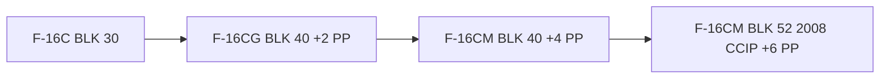
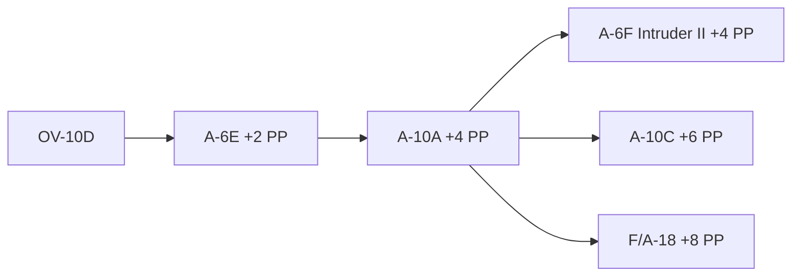
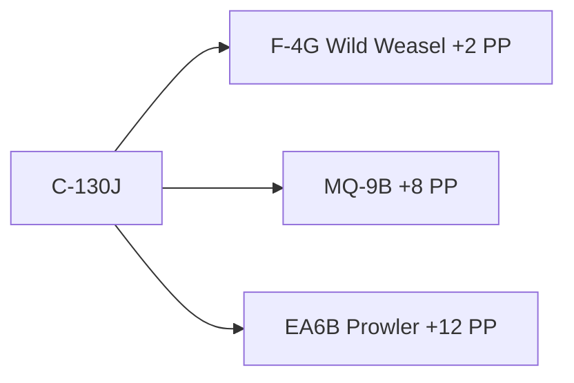

# Procurement Process

Procurement occurs during your initial PMC creation phase and every time you exit a theater. The Black Market is available in between missions and during regular Procurement. You spend Procurement Points as currency for any acquisitions. It is worth saving a few PP's for things like gifts, favors, or patronage as well as for emergency rush replacements and Black Market gems.

## Your Supplier

Your supplier will have aircraft available for you that follows a path. This [Upgrade](upgrade.md) path will take you from early models with limited capability and bring you to more advanced platforms with additional weaponry. There are certain options that have no upgrade path and are instead stand alone air frames.

Look at the initial packages below for the starting aircraft available. Then check the [Upgrade](upgrade.md) page for the progression. Upgrades occur during the Procurement phase. Think of it as sending your plane to the dealer for a new stereo, it's not something you'd want to do in a war zone.

## Starting Packages

**Your starting package costs 1 PP per aircraft**. The starting aircraft are fixed, but later procurement packages will allow much more variety. Typical flight sizes for fighters is two, strike is four, and support is 1. 

**Each player brings 5 PP's as well as any bonuses they may have**. Later procurement rounds are dependent on mission earnings.

For example if you have three players you will have 15 PP's to start with. The corporation could purchase 4 fighters, 4 attack, 1 support, (for a total of 9 points) and have 6 points remaining for the Black Market, facilities upgrades, or for rush replacements while deployed.

### Broadstreet Ford, Lincoln, and Military

BSFLM offers US, NATO, and NATO Adjacent aircraft such as the F-16, F-4, and the venerable F-14. They also have a whole slew of exciting aircraft such as the Turkish Terminator. On the downside the upgrade path can be expensive and there is a long path of upgrade weaponry per airframe. But once invested thoroughly you have some of the most capable aircraft in the world.

#### Starting Package

##### **F-16C BLK 30**

This aircraft comes in with a wide range of cluster munitions which is perfect for the budding pilots in your group. Accuracy can be secondary to a large area of denial. Speaking of denial, this baby comes with a factory fresh Shrike, which is great for knocking out hostile radars and SAM sites. Oh! Just in case you need more accuracy, the low drag bombs are great for old school bomb dropping. The AIM-9M is a snappy little infrared missile with great characteristics that pair awesome with the F-16C.

It also has amazing upgrade potential, the Mavericks, Harms, and later models of the F-16 can fit JDAM's, LGB's, and the crowd favorite AAMRAM! This is how you get started down that road. A true multi-role. Now let's go talk to my finance manager and see what kind of deal we can cut.

**Upgrade Path**

[CMANO-DB Link](https://cmano-db.com/aircraft/1039/)

**Standard Equipment**

-   :material-rocket-launch-outline: Air to Air

    ---

     AIM-9M Sidewinder

-   :material-rocket: Guided Weapons

    ---

    AGM-45B Shrike Anti Radiation Missile

-   :material-radar: Radar

    ---
    APG-68 Radar - 111 km Range

-   :material-bomb: Dumb Weapons

    ---

    * MK84 2000lb LDGP
    * MK82 500lb LDGP
    * MK20 Rockeye II Cluster Bomb
    * CBU-52/B Cluster Bomb
    * CBU-71A Cluster Bomb
    * CBU-87/B Cluster Bomb
    * CBU-89/B GATOR Cluster Bomb + Mines
    * Fuel Drop Tanks

!!! Important

    Upgrades only available on airframes which offer them natively. For example the F-16C BLK 30 does not offer the AAMRAM. So you could not purchase this upgrade for that airframe. 

| Upgrade      | Description                          |    Cost per Airframe|
| ----------- | ------------------------------------ | ------- |
| `AIM-120A/B`       |      Air to Air Missile  | 1 PP
| `AIM-120C`       | Air to Air Missile | 5 PP
| `AIM-9X`    | All Aspect Short Range Missile | 3 PP
| `AGM-65B` | Guided Missile | 1 PP
| `AGM-65D` | More Capable Guided Missile | 2 PP
| `LGB` | Laser Guided Bombs | 3 PP
| `JDAM` | GPS Guided Bombs | 4 PP
| `AGM-65G` | More Capable Guided Missile | 1 PP
| `AGM-88B` | Anti Radiation Missile | 5 PP
| `AGM-160` | Decoy | 4 PP

It is the MC's discretion as to the upgrade path. For example should you first upgrade to AIM-120A, before AIM-120C? Or can you go directly? In some cases the airframe may only natively mount the 120C so this would be the only path. In such case you would not need to pay for the earlier upgrade.

##### **OV-10D Bronco USMC Version**

The venerable Bronco, long in the tooth but an extraordinarily tough aircraft. This is the final version of the Vietnam era attack aircraft. The weaponry is limited to air-to-ground ordnance and lacks any stand off capability. It can loiter for support ops using its onboard laser designator and sports an ECM package, on the downside it has limited upgrade potential to a version used by the Phillipine military. But later upgrades into different airframes is potent!

**Upgrade Path**

-   :material-rocket-launch-outline: Air to Air

    ---

     AIM-9L Sidewinder

-   :material-rocket: Guided Weapons

    ---

    None

-   :material-radar: Radar

    ---
    Radar Warning Receiver

-   :material-bomb: Dumb Weapons

    ---

    * MK82 500lb LDGP
    * Hydra 70mm Rockets
    * Zuni 127mm Rockets
    * MK77 500lb Incendiary Bombs
    * 150 gal Drop Tank

##### C-130J

Cargo, and not much else. Able to perform short landings and short takeoffs it fills a vital role to bring supplies and personnel into combat zones, or get them out. On the downside it’s a one trick pony and does not perform combat ops without significant upgrades to the Spooky line, but even then it is very vulnerable. 

**Upgrade Path**

### Ivanov Brothers

#### Starting Package

### Klaus and Pedersen

####